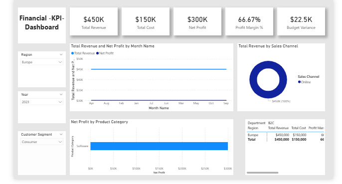

# Financial KPI Monitoring & Profitability Dashboard

## 📌 Project Objective
To design an interactive Business Intelligence dashboard that allows the management team to monitor financial health, track budget variances, and analyze profitability across various regions and product categories.

## 🛠️ Tools Used
- **Power BI:** Data visualization, DAX, Data Modeling
- **Power Query:** ETL (Extract, Transform, Load) processes
- **Excel/CSV:** Raw data source

## 📊 Dataset Description
The dataset contains corporate financial records including Revenue, COGS, Operating Expenses, Budgets, and Sales Channels over a fiscal year.

## ⚙️ Core Power Query Steps
- Handled missing values and standardized data types for financial accuracy.
- Generated dynamic Calendar columns (Year, Quarter, Month).
- Cleaned and categorized structural data hierarchies (Region > Department).

## 🧮 Key DAX Measures
- `Net Profit = [Total Revenue] - [Total Cost]`
- `Profit Margin % = DIVIDE([Net Profit], [Total Revenue], 0)`
- `Budget Variance = [Total Revenue] - [Budgeted Revenue]`

## 💡 Key Business Insights
1. **Software vs. Hardware:** Software drives higher net margins despite hardware having higher raw sales volume.
2. **Regional Growth:** Europe exceeded budget targets by 8% in Q2.
3. **Cost Control:** Operating expenses spike during Q4 marketing pushes, heavily impacting the bottom line.

## 📸 Dashboard Preview

## 🚀 Conclusion
This dashboard streamlines financial reporting, shifting the business from manual spreadsheet analysis to automated, real-time data-driven decision-making.
